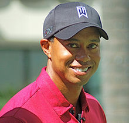

# Cheat Sheet


## Typical keras model
```
from keras.layers import Dense, Activation

# Must provide either input_dim or input_shape for the **first layer only**
model.add(Dense(units=64, input_dim=100, activation='relu'))
model.add(Dense(units=10))
model.add(Activation('softmax'))

model.compile(loss='sparse_categorical_crossentropy',
              optimizer='adam',
              metrics=['accuracy'])
```
Whatever the layer that you need, you simply add it (eg. `model.add(LSTM(...))`, `model.add(Dropout(...))`).

Training the model:
```
model.fit(X_train, y_train, epochs=5, batch_size=256)
```
Predicting with model:
```
model.predict(X_train, batch_size=256)
```

## Final Activation function
1. Regression - None or 'linear' (no activation implies linear)
2. Classifiction (two classes) - 'sigmoid'
3. Classifiction (multiple classes) - 'softmax'

## Loss function
1. Regression - 'mean_squared_error'
2. Classifiction (two classes) - 'binary_crossentropy'
3. Classifiction (multiple classes) - 'sparse_categorical_crossentropy'
It is sparse since with the other option 'categorical_crossentropy' you need to provide a one hot encoded version of the classes.

### References:
1. https://keras.io/
